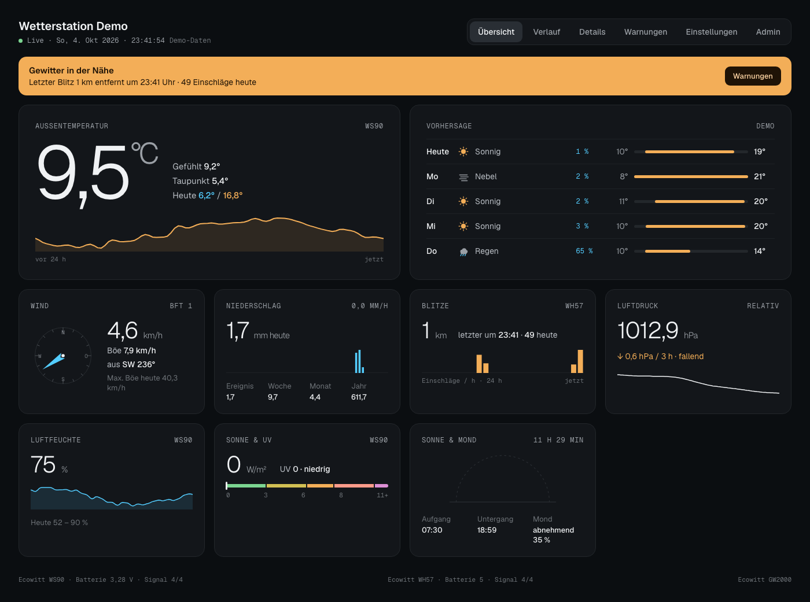

<p align="center">
  
</p>

<h1 align="center">Ecowitt Weather Dashboard</h1>

<p align="center">
  A public web dashboard for a personal weather station whose data lives in <strong>Home Assistant</strong>.
</p>

> [!NOTE]
> **This is a hobby project, vibe-coded with AI.** It runs my own weather station, but it is not actively or professionally maintained. Expect rough edges, and don't expect quick fixes or regular releases.
>
> That said, **help and ideas are very welcome!** If you find a bug, have a feature idea or want to improve something, feel free to open an issue or a pull request.

---



## What it does

A single Docker container serves the web interface plus a small, read-only API. Your Home Assistant URL and access token stay on the server; visitors' browsers only ever see finished measurements, never the token, your coordinates or your entity IDs.

Built and tested with an **Ecowitt WH90** (temperature, humidity, ultrasonic wind, piezo rain, solar/UV), an **Ecowitt WH57** (lightning) and an Ecowitt gateway (pressure) via the Home Assistant Ecowitt integration. Other sensors work as well, as long as they are in Home Assistant.

**Screens** (German and English, switchable per visitor in Einstellungen/Settings):

- **Übersicht/Overview:** temperature, 5-day forecast, wind compass, rain, lightning, pressure trend, humidity, sun & UV, sun & moon
- **Verlauf/History:** charts for day / week / month / year, plus all-time records and CSV export
- **Details:** one measurement in depth, with today's values, records and sensor/battery info
- **Warnungen/Alerts:** read-only status of configurable alerts (lightning nearby, frost, gusts, heavy rain, high UV) and their history
- **Einstellungen/Settings:** visitors can choose their own units (°C/°F, km/h, m/s, mph, Bft, hPa/mmHg/inHg, mm/in) and interface language

Alert rules themselves (their label, description and message text, whether default or configured by you) are shown exactly as written, in whichever language you wrote them — they aren't machine-translated.

Units from Home Assistant are converted automatically, so it doesn't matter whether your HA runs metric or imperial.

## Requirements

- Docker with Docker Compose
- Home Assistant with:
  - the **Recorder** enabled. It provides the 24-hour history; week, month, year and records come from the long-term statistics, which need sensors with a `state_class` (the Ecowitt integration provides that).
  - a **long-lived access token**. Ideally create a separate non-admin user in Home Assistant just for this dashboard and create the token for that user (*Profile → Security → Long-lived access tokens*).

## Installation with Docker Compose

### 1. Create a folder

```bash
mkdir -p wetterstation/config wetterstation/data
cd wetterstation
```

### 2. Get the example configuration

```bash
curl -o config/config.yaml https://raw.githubusercontent.com/0xvisualiris/ecowitt-weather-dashboard/main/config/config.example.yaml
```

Open `config/config.yaml` and adjust it to your setup. At minimum:

- `homeassistant.url`: the address of your Home Assistant, e.g. `http://192.168.1.10:8123`
- `sensors`: your entity IDs. You'll find them in Home Assistant under *Developer tools → States*. Remove any sensors you don't have; the matching cards are then hidden automatically.

Every option is explained in the comments of the example file.

### 3. Store your token in a `.env` file

```bash
echo "HA_TOKEN=your-long-lived-access-token" > .env
```

Never share this file or commit it to Git.

### 4. Create `compose.yaml`

```yaml
services:
  wetterstation:
    image: ghcr.io/0xvisualiris/ecowitt-weather-dashboard:latest
    container_name: wetterstation
    user: "1000:1000"
    restart: unless-stopped
    ports:
      - "47813:47813"
    environment:
      HA_TOKEN: ${HA_TOKEN}
      TZ: Europe/Berlin
    volumes:
      - ./config:/config:ro
      - ./data:/data
```

The container runs as an unprivileged user, never as root. The `user:` line must match the owner of your `config` and `data` folders, otherwise the container can't read the config or save the alert history. You can check the owner with `ls -ln`; the first two numbers are the user and group ID. Either put those numbers in the `user:` line, or give the folders to UID 1000:

```bash
sudo chown -R 1000:1000 config data
```

### 5. Start it

```bash
docker compose up -d
docker compose logs -f
```

In the logs you should see `[config] loaded /config/config.yaml` and `[ha] authenticated`. The dashboard is then available at `http://<your-host>:47813`.

If you want a different port, only change the left number, e.g. `"8090:47813"`.

> [!TIP]
> **Just want to try it?** If there is no `config/config.yaml`, the container starts in **demo mode** with synthetic data, so you can look around before connecting Home Assistant.

## Configuration overview

Everything lives in `config/config.yaml`. The most important sections:

| Section           | What it's for                                                                  |
|-------------------|--------------------------------------------------------------------------------|
| `station`         | Name, altitude, commissioning date (start of records), devices with battery/signal entities — or set via the admin page |
| `homeassistant`   | URL and token (use `${HA_TOKEN}` to read it from the environment) — or set via the admin page |
| `sensors`         | Entity IDs for temperature, wind, rain, pressure, lightning, … — or set via the admin page |
| `forecast`        | DWD station for the daily forecast, bias-corrected from your own station's live reading (falls back to a `weather.*` entity) |
| `alerts`          | Alert rules with thresholds and messages — or set via the admin page           |
| `ui`              | Refresh interval, "stale" timeout, default units for new visitors              |

### Forecast

The "Vorhersage" card is calculated from [DWD](https://www.dwd.de) MOSMIX (a
numerical weather model with statistical post-processing) for a station you
pick, with the next few hours nudged toward what your own Ecowitt station is
actually reading right now. Set `forecast.dwd_station_id` in `config.yaml` to
a DWD station ID from [DWD's station list](https://opendata.dwd.de/weather/local_forecasts/poi/poi.txt)
(look up the one nearest you by name). If it's left unset, or DWD can't be
reached, the dashboard falls back to a Home Assistant `weather.*` entity
(`forecast.entity`), the same as before.

### Admin page

As an alternative to editing `config.yaml`, the Home Assistant URL/token,
sensor entity IDs, DWD station ID, alert rules and station/device info can
all be set from the dashboard itself at `/#/admin/login` (an "Admin" link
sits in the header navigation). Default login is **admin / admin**, and
you're required to change the password before doing anything else. Saving
settings there restarts the container (same as editing `config.yaml` would)
to apply them.

Anything already set in `config.yaml` (or an `HA_URL`/`HA_TOKEN` environment
variable) always wins and shows as locked on the admin page — the two are
alternatives per field, not a UI on top of the file. A freshly started
container with nothing configured anywhere opens directly on this login page
instead of an empty demo dashboard, so first-time setup is the first thing
you see.

If the dashboard is reachable beyond your own LAN, put it behind HTTPS (see
"Making it public" below) before relying on the admin login: the session
cookie is `HttpOnly`/`SameSite=Strict` but not marked `Secure`, since many
setups are plain HTTP on a LAN.

After changing the config, restart the container:

```bash
docker compose restart
```

If your station reports every 60 seconds, these settings work well:

```yaml
ui:
  refresh_seconds: 30
  stale_after_seconds: 300
```

### Two-factor authentication

The admin page can require a second factor (TOTP, the standard 6-digit
code from an authenticator app) on top of the password. It's off by
default; turn it on from a "Zwei-Faktor-Authentifizierung" card near the
top of the admin page, once you're logged in with the password already
changed:

1. Click **"2FA einrichten"**. A secret key and a link are shown.
2. Add it to an authenticator app (Google Authenticator, Authy, 1Password,
   Apple's built-in Passwords app, …) — either type the secret in manually,
   or tap the link if you're setting this up on the same device the app is
   on.
3. Enter the 6-digit code the app now shows and confirm. From then on,
   logging in asks for a fresh code after the password.

No new dependency and no external service: the TOTP codes are generated
and checked entirely on the server (`server/src/totp.js`), the same way
every other authenticator app does it (RFC 6238). There's no QR code —
just the secret and a tappable `otpauth://` link — to avoid pulling in a
QR-code library or calling out to a third-party service to render one.

Turning it off again (**"2FA deaktivieren"**) asks for the current
password, not a code — if you still have your authenticator, you don't
need to turn it off at all; if you've lost it, see below.

### Forgot the admin password? Lost your 2FA device?

There's no "forgot password" email flow (this app doesn't send email at
all), so recovery is a filesystem operation: stop the container, delete
(or move aside) `data/admin.json` — note this is the data directory you
mounted at `/data`, not the `config/config.yaml` you mounted at `/config`,
those are unrelated files — and start it again:

```bash
docker compose down
rm data/admin.json   # or: mv data/admin.json data/admin.json.bak
docker compose up -d
```

This resets the login to **admin / admin** (password-change required again
on next login) and turns 2FA back off, exactly like a brand-new install.

**What this does and doesn't affect:** `admin.json` only holds admin-page
state — the password, the 2FA secret, and any Home Assistant/sensor/
forecast/alert/station settings you entered *through the admin page*
rather than `config.yaml`. Deleting it resets all of that, but never
touches `config/config.yaml` — anything configured there (and already
shown as "locked" on the admin page) is unaffected and doesn't need
re-entering. If you've configured everything through `config.yaml` instead
of the admin page, this reset has nothing else to undo.

### Environment variables

| Variable      | Meaning                                                  | Default               |
|---------------|----------------------------------------------------------|-----------------------|
| `HA_TOKEN`    | Home Assistant long-lived access token                   | –                     |
| `HA_URL`      | Overrides `homeassistant.url`                            | –                     |
| `TZ`          | Time zone (otherwise `station.timezone` or the one from HA) | –                  |
| `PORT`        | Port inside the container                                | `47813`               |
| `CONFIG_PATH` | Path to the config file                                  | `/config/config.yaml` |
| `DATA_DIR`    | Where the alert history is stored                        | `/data`               |
| `DEMO`        | `1` forces demo mode                                     | –                     |

## Updating

```bash
docker compose pull
docker compose up -d
```

`pull` alone only downloads the new image; `up -d` replaces the running container with it.

## Kiosk / tablet mode

Open `http://<your-host>:47813/?kiosk=1` to show only the overview without navigation. Tapping the station name toggles fullscreen. Values refresh automatically.

## Making it public

Put the container behind a reverse proxy with HTTPS (e.g. Nginx Proxy Manager, Traefik, Caddy or a Cloudflare Tunnel).

The API is strictly read-only. It never returns your token, coordinates or entity IDs, and it sends a strict Content Security Policy. Fonts are served from the container itself, so there are no requests to Google Fonts.

## API

All public endpoints are `GET` and read-only. Values are returned in °C, km/h, hPa, mm and km. (The separate, authenticated `/api/admin/*` surface behind the admin page is the one exception — see "Admin page" above.)

| Endpoint                               | Content                                                                        |
|----------------------------------------|--------------------------------------------------------------------------------|
| `/api/config`                          | Station info, available measurements, UI settings                              |
| `/api/current`                         | Current values, today's min/max, rain totals, sparklines, forecast, sun/moon, active alerts |
| `/api/history?metric=temp&range=day`   | History and statistics. `metric`: temp, hum, wind, rain, press, solar, uv, light. `range`: day, week, month, year |
| `/api/detail?metric=temp`              | Today's values, records, sensor info                                           |
| `/api/records`                         | All-time records                                                               |
| `/api/alerts`                          | Alert rule status and history                                                  |
| `/healthz`                             | Health check                                                                   |

## Contributing & ideas

Since this is a hobby project, any help is appreciated: bug reports, feature ideas, support for other weather stations, or code improvements.

- **Found a bug or have an idea?** Open an [issue](../../issues).
- **Want to change something yourself?** Pull requests are welcome.

Please be patient with response times. This runs in my spare time.

### Local development

```bash
# Server in demo mode (port 47813)
cd server && npm install && DEMO=1 npm run dev

# Frontend with hot reload, forwards /api to :47813
cd web && npm install && npm run dev

# Backend test suite
cd server && npm test
```

**Project structure:**

- `server/`: Node 22 without a framework; only `yaml` and `suncalc` as dependencies. Talks to Home Assistant via its WebSocket API.
- `web/`: Vite, React and TypeScript. Charts are plain SVG, no chart library.
- `.github/workflows/docker-publish.yml`: builds the Docker image (amd64 + arm64) and publishes it to GHCR on every push to `main`.
